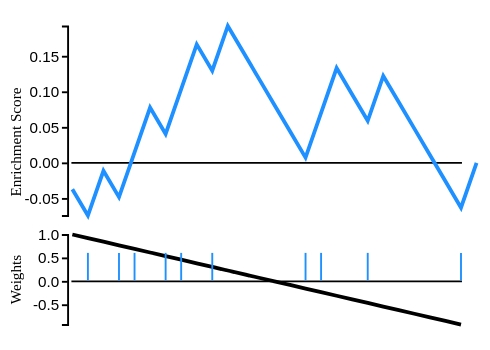

# react-GSEA

A react-wrapped d3 visualization for rendering GSEA running sum visualizations in browser.



## Installation
```
npm i --save maayanlab/react-gsea
```

### Usage
```jsx
import ReactGSEA from 'react-gsea'

// see public for example
const your_viz = (
  <ReactGSEA data={...} />
)
```

## Development
```
# install npm dependencies
npm install

# start development server
npm run dev
```
